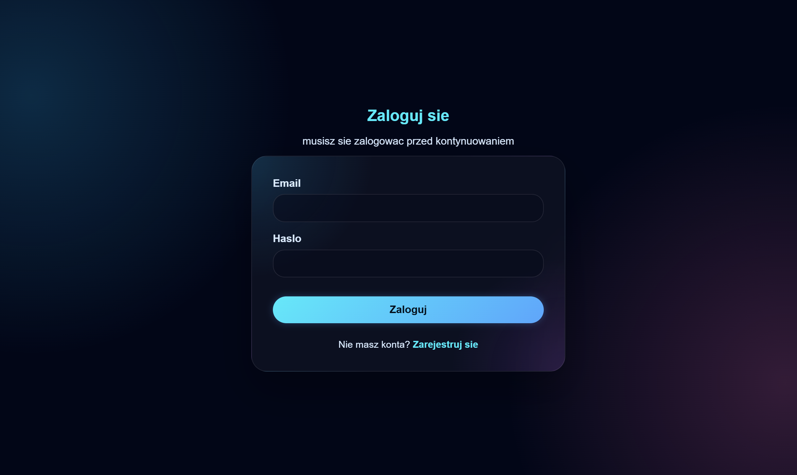
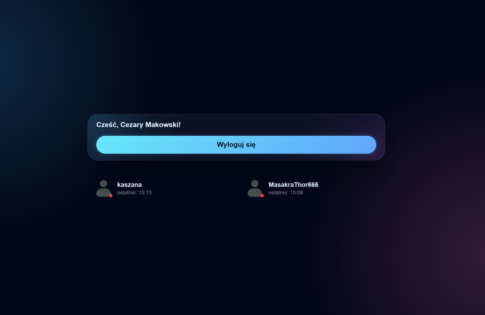
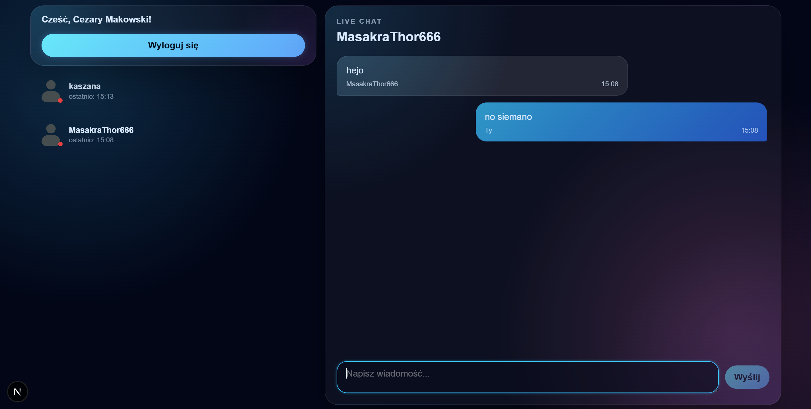

# CzarKomunikator

Fullstackowy komunikator internetowy z czatem w czasie rzeczywistym — zbudowany w Next.js 16, React 19 i Supabase Realtime. Obsługuje presence (kto jest online), wskaźnik pisania, potwierdzenia odczytu (seen), optimistic updates i responsywny interfejs w stylu glassmorphism.


## Zrzuty ekranu

### Strona logowania



### Strona główna — lista użytkowników



### Widok czatu



## Funkcjonalności

- **Rejestracja i logowanie** — system oparty na NextAuth.js (Auth.js v5) z providerem Credentials
- **Lista użytkowników** — widok wszystkich zarejestrowanych użytkowników ze statusem online/offline i datą ostatniej aktywności
- **Czat w czasie rzeczywistym** — wiadomości dostarczane natychmiast przez Supabase Realtime (Postgres Changes)
- **Wskaźnik pisania** — widoczna informacja „X pisze..." dzięki Supabase Broadcast
- **Presence** — śledzenie aktywnych użytkowników w czasie rzeczywistym (Supabase Presence)
- **Potwierdzenia odczytu (seen)** — wiadomości oznaczane jako przeczytane w bazie danych, status propagowany w czasie rzeczywistym do nadawcy (✓ wysłane / ✓✓ przeczytane)
- **Optimistic Updates** — wiadomości pojawiają się natychmiast po wysłaniu, zanim serwer potwierdzi zapis
- **Ponowne wysłanie** — przy błędzie wysyłki użytkownik może ponowić próbę jednym kliknięciem
- **Responsywność** — mobilny sidebar z listą użytkowników (hamburger menu)
- **Walidacja** — formularze walidowane po stronie klienta (Zod + React Hook Form) i serwera

## Stack technologiczny

| Warstwa          | Technologia                                               |
| ---------------- | --------------------------------------------------------- |
| Framework        | Next.js 16 (App Router, React 19)                         |
| Język            | TypeScript 5                                              |
| Baza danych      | PostgreSQL (Supabase)                                     |
| ORM              | Prisma 7 z `@prisma/adapter-pg`                           |
| Autentykacja     | NextAuth.js v5 (Auth.js)                                  |
| Real-time        | Supabase Realtime (Presence, Broadcast, Postgres Changes) |
| State management | TanStack React Query v5                                   |
| Formularze       | React Hook Form + Zod v4                                  |
| Hashowanie haseł | bcrypt                                                    |
| Testy            | Jest + ts-jest                                            |
| Styling          | CSS Modules (glassmorphism)                               |

## Struktura projektu

```
├── app/
│   ├── api/
│   │   ├── auth/[...nextauth]/ — endpoint NextAuth
│   │   ├── chat/               — tworzenie/pobieranie konwersacji
│   │   ├── messages/           — pobieranie i wysyłanie wiadomości
│   │   ├── rejestracja/        — rejestracja nowego użytkownika
│   │   └── user/               — lista użytkowników, aktualizacja statusu
│   ├── konwersacja/[id]/       — strona czatu z danym użytkownikiem
│   ├── login/                  — strona logowania
│   └── rejestracja/            — strona rejestracji
├── components/                 — komponenty UI (Chat, UserList, UserTile, itp.)
├── hooks/                      — custom hooks (useChat, usePresenceSubscription)
├── lib/                        — konfiguracja Prisma, Supabase, typy, schematy Zod
├── prisma/                     — schemat bazy danych i migracje
├── styles/                     — CSS Modules
├── utils/                      — funkcje pomocnicze
└── __tests__/                  — testy jednostkowe (Jest)
```

### Wymagania

- Node.js 20+
- Konto Supabase z projektem PostgreSQL

### Instalacja

```bash
git clone <repo-url>
cd czarkomunikator
npm install
```

### Zmienne środowiskowe

Utwórz plik `.env` w katalogu głównym:

```env
DATABASE_URL="postgresql://..."
NEXT_PUBLIC_SUPABASE_URL="https://xxx.supabase.co"
NEXT_PUBLIC_SUPABASE_ANON_KEY="eyJ..."
NEXTAUTH_SECRET="losowy-sekret"
NEXT_PUBLIC_NEXTAUTH_URL="http://localhost:3000"
```

### Migracja bazy danych

```bash
npx prisma migrate dev
```

### Uruchomienie

```bash
npm run dev
```

Aplikacja będzie dostępna pod adresem `http://localhost:3000`.

## Testy

```bash
npm test            # jednorazowe uruchomienie
npm run test:watch  # tryb watch
```

Testy obejmują:

- **Schematy Zod** — walidacja `messageSchema`, `sendMessageSchema`, `registryFormSchema`
- **API `/api/user`** — pobieranie listy użytkowników, aktualizacja statusu
- **API `/api/rejestracja`** — rejestracja, duplikaty email/nazwy, walidacja danych
- **API `/api/messages`** — pobieranie, wysyłanie i oznaczanie wiadomości jako przeczytane
- **API `/api/chat`** — tworzenie konwersacji, weryfikacja uprawnień
- **Hook `useChat`** — pobieranie wiadomości, wysyłanie przez POST, subskrypcja kanałów Supabase, typing status, oznaczanie jako przeczytane
- **Hook `usePresenceSubscription`** — subskrypcja obecności, obsługa zdarzeń join/leave, cleanup
- **Utility `updateLastSeen`** — wywołanie fetch z poprawnym URL, obsługa błędów
- **Komponent `LoginForm`** — renderowanie pól, logowanie, obsługa błędów, walidacja
- **Komponent `RegistryForm`** — renderowanie pól, walidacja formularza, rejestracja, obsługa duplikatów i błędów sieciowych

## Uwagi dotyczące rejestracji użytkowników

Obecny system rejestracji oparty jest na prostym formularzu z email + hasło (Credentials provider). Jest to rozwiązanie uproszczone, wystarczające na potrzeby tego projektu.

W aplikacji produkcyjnej postawiłbym przede wszystkim na **logowanie przez zewnętrznych providerów** (Google, Facebook, GitHub itp.), co eliminuje większość problemów z zarządzaniem hasłami i weryfikacją tożsamości.

Do rejetracji przez email + hasło, dodałbym **weryfikację autentyczności adresu email** — po rejestracji użytkownik otrzymywałby wiadomość z linkiem aktywacyjnym zawierającym jednorazowy token. Konto byłoby aktywne dopiero po kliknięciu tego linku. Zapobiegałoby to rejestracji na nieistniejące lub cudze adresy email.
